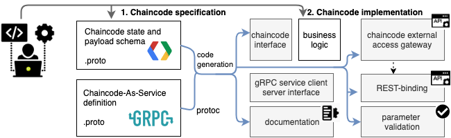

# Fabric-Golang application

## How to create application project

### Main points

* `Protobuf` message and service definitions allows to model chaincode in high level Interface Definition Language (IDL)
* [Code generation](https://blog.golang.org/generate) allows to automate development process
  of creating API's, SDK, documentation for chainode

### Development steps

1. Define model using `.proto` file
2. Generate code and documentation with generators
3. Implement chaincode as service and tests
4. Create chaincode binary
5. Create API

## Prerequisites

### Generators

Generators allows to automatically build lot of useful code and docs : Golang structures,
validators, gRPC service interface and client, documentation in Markdown format and Swagger specification,
chaincode gateway for implementing API or SDK and mapper for embedding strong typed gRPC service
to chaincode implementation.

1. [Protobuf generator](https://github.com/golang/protobuf)

2. [Validator generator](https://github.com/mwitkow/go-proto-validators)

3. [gRPC gateway generator](https://github.com/grpc-ecosystem/grpc-gateway)

4. [Documentation generator](https://github.com/pseudomuto/protoc-gen-doc)

5. [Chaincode gateway generator](https://github.com/s7techlab/cckit/tree/master/gateway)

#### Install generators

`cd geterators && ./install.sh`

This will place five binaries in [generators/bin](generators/bin);

* `protoc-gen-go`
* `protoc-gen-govalidators`
* `protoc-gen-grpc-gateway`
* `protoc-gen-swagger`
* `protoc-gen-doc`